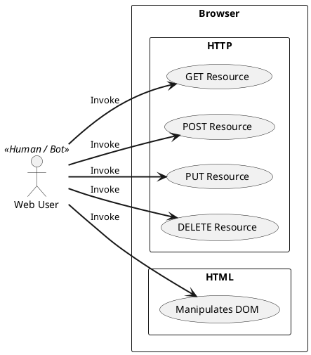
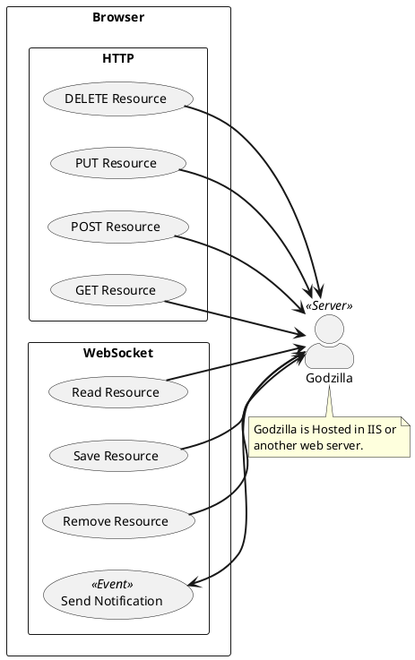

Use Cases
=========

## Overall Use Cases

### UC List

* [GET Resource (HttpGet)](Http.md#httpget)
* [POST Resource (HttpPost)](Http.md#httppost)
* [PUT Resource (HttpPut)](Http.md#httpput)
* [DELETE Resource (HttpDelete)](Http.md#httpdelete)

## Godzilla Use Cases

### UC List

* [Read Resource (ReadRes)](WebSocket.md#readres)
* [Save Resource (SaveRes)](WebSocket.md#saveres)
* [Remove Resource (RemoveRes)](WebSocket.md#removeres)
* [Send Notification (Notification)](WebSocket.md#notification)
